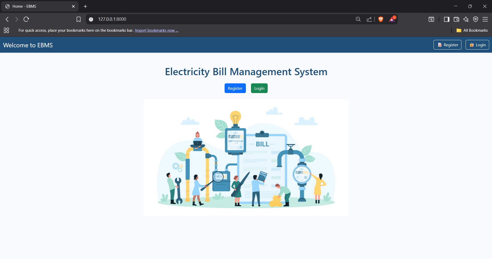

# ⚡ Electricity Bill Management System (EBMS)

An end-to-end web application built with **Python (Django)** and **MySQL (phpMyAdmin)** for managing electricity billing operations. This system offers secure user registration, admin approval workflows, electricity usage tracking, bill generation, and PDF invoice printing.

---

## 🚀 Features

### 👤 User Panel
- Registration with profile details (pending admin approval)
- Login after approval
- View:
  - Profile details
  - Electricity usage
  - Monthly bill (with breakdown)
  - Billing rate slabs
- Generate monthly bill & download PDF
- Request profile deletion (admin approval required)
- Update personal profile details only

### 🛠️ Admin Panel
- Admin login (default account: `admin / admin@123`)
- Approve or reject new user registration
- View & manage:
  - All customer details
  - Electricity usage data
  - Bills & payments
  - Billing rate slabs
- Approve profile deletion requests
- Full control over the database

---

## 🧱 Database Structure

Database Name: `db_project_ebms`

| Table             | Description                                 |
|------------------|---------------------------------------------|
| `users`          | Stores all user credentials & roles         |
| `customers`      | User profile details                        |
| `user_requests`  | Registration & deletion request records     |
| `electricity_usage` | Monthly electricity usage (meter reading) |
| `bills`          | Generated bills per user per month          |
| `payments`       | Bill payments records                       |
| `billing_rates`  | Electricity billing slabs                   |

📂 SQL Dump Included: [`db_project_ebms.sql`](./db_project_ebms.sql)

---

## 🖥️ Tech Stack

- **Backend:** Django (Python)
- **Frontend:** HTML, CSS (Bootstrap optional), JS
- **Database:** MySQL (phpMyAdmin via XAMPP)
- **PDF Generation:** `xhtml2pdf` or `reportlab` (based on implementation)

---

## 📸 Screenshots

## System Implementation

| Home Page | 
|-----------------------------|
|  |
- 🔐 Login & Registration Page
- 🖼️ Admin Dashboard
- 💻 User Dashboard (Usage & Bills)
- 🧾 PDF Invoice Preview

---

## ⚙️ Installation & Setup

### 1. Clone the repository

```bash
git clone https://github.com/yourusername/electricity-bill-management.git
cd electricity-bill-management
```

### 2. Create Virtual Environment & Install Requirements

```bash
python -m venv venv
source venv/bin/activate  # For Linux/macOS
venv\Scripts\activate     # For Windows

pip install -r requirements.txt
```

### 3. Setup MySQL Database

1. Start XAMPP and open phpMyAdmin
2. Import the `db_project_ebms.sql` file
3. Update `settings.py` with your MySQL credentials:

```python
DATABASES = {
    'default': {
        'ENGINE': 'django.db.backends.mysql',
        'NAME': 'db_project_ebms',
        'USER': 'root',
        'PASSWORD': '',
        'HOST': 'localhost',
        'PORT': '3306',
    }
}
```

### 4. Run Migrations & Start Server

```bash
python manage.py makemigrations
python manage.py migrate
python manage.py runserver
```

Visit: http://127.0.0.1:8000/

---

## 🔐 Default Admin Credentials

```
Username: admin
Password: admin@123
```

---

## 📌 Future Enhancements

- ✅ Email notifications on approval or bill generation
- ✅ Bill payment gateway integration
- ✅ Monthly auto bill generation
- ✅ Graphs and analytics for usage trends
- ✅ Password encryption (currently stored as plaintext)

---

## 🤝 Contributing

1. Fork this repository
2. Create your feature branch (`git checkout -b feature/new-feature`)
3. Commit your changes (`git commit -m 'Add new feature'`)
4. Push to the branch (`git push origin feature/new-feature`)
5. Open a Pull Request

---

## ✨ **Developed with ❤️ by :**
### 👥 Team

| Name               | GitHub Profile                               |
|--------------------|-----------------------------------------------|
| Rushikesh Sonwane    | [@RushikeshSonwane03](https://github.com/RushikeshSonwane03/) |
| Harshita Singh      | [@HS-4791](https://github.com/HS-4791)        |
| Harshey Sharma     | [@Harshey260](https://github.com/Harshey260)        |
---

**Need help with:**
- Adding a `requirements.txt` file for your Django environment?
- Generating dummy screenshots placeholders?
- Deploying this on PythonAnywhere or Heroku?

Let me know!